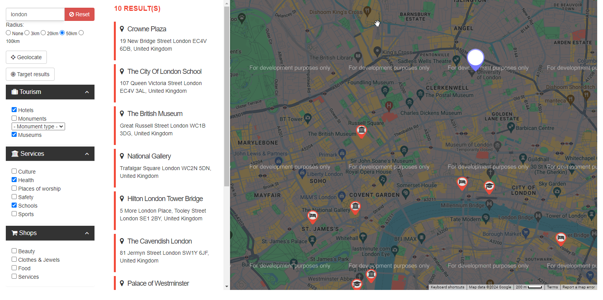
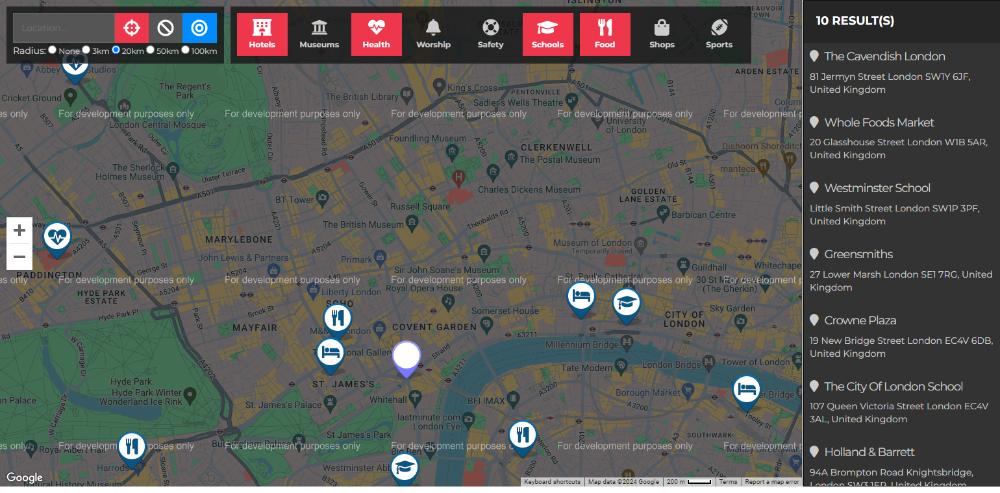

# Google Maps Integration Project

This project integrates Google Maps to display various points of interest (POIs) around a specific location. The POIs can be filtered by categories such as tourism, services, and shops.




## Features

- **Geolocation:** Automatically detect and set your location.
- **Radius Selection:** Filter results based on distance from the location.
- **Category Filters:** Refine your search by selecting categories like tourism, services, and shops.
- **Interactive Map:** View POIs directly on the map with markers indicating their locations.
- **Detailed List View:** Display POI details such as name and address in a list format.

## Installation

### Prerequisites

Ensure you have the following installed:

- Node.js
- npm (Node Package Manager)

### Steps

1. **Clone the repository:**

    ```bash
    git clone https://github.com/username/googlemap__search.git
    cd googlemap__search
    ```

2. **Install dependencies:**

    ```bash
    npm install
    ```

3. **Set up the environment variables:**

    Create a `.env` file in the root directory with the following content:

    ```bash
    REACT_APP_GOOGLE_MAPS_API_KEY=your_google_maps_api_key
    ```

4. **Run the development server:**

    ```bash
    npm start
    ```

5. **Open the application:**

    Navigate to `http://localhost:3000` in your web browser.

## Usage

- **Search by Location:** Enter a location in the search bar to view nearby POIs.
- **Adjust Radius:** Select a radius to filter the POIs by proximity.
- **Category Filtering:** Use the checkboxes to filter POIs by categories like Hotels, Museums, Health services, etc.
- **View Details:** Click on a POI in the list or on the map marker to view more details.

## License

This project is licensed under the MIT License - see the [LICENSE](LICENSE) file for details.
